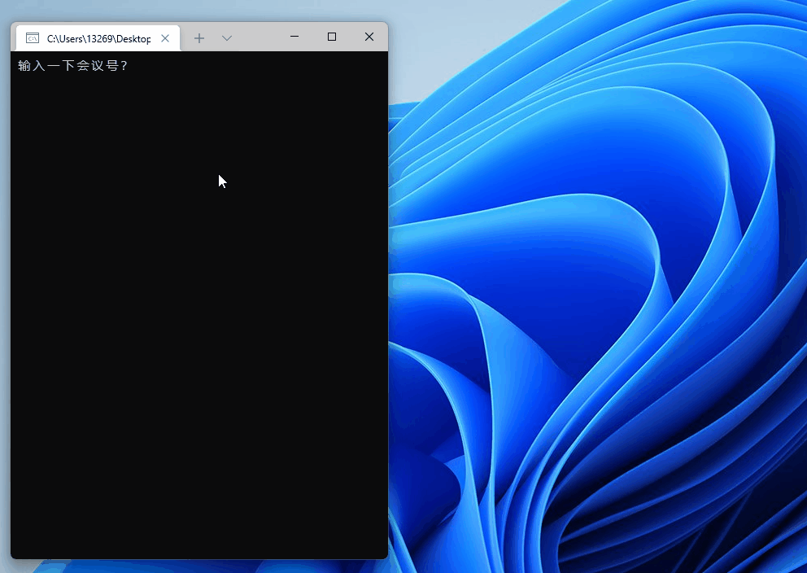
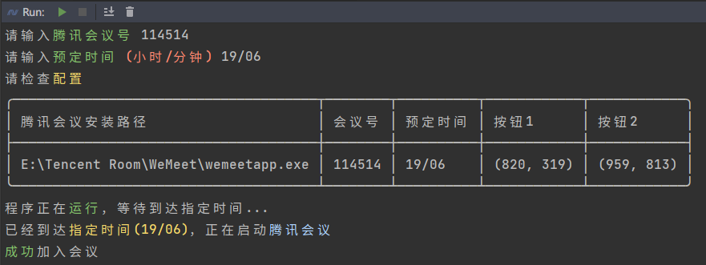
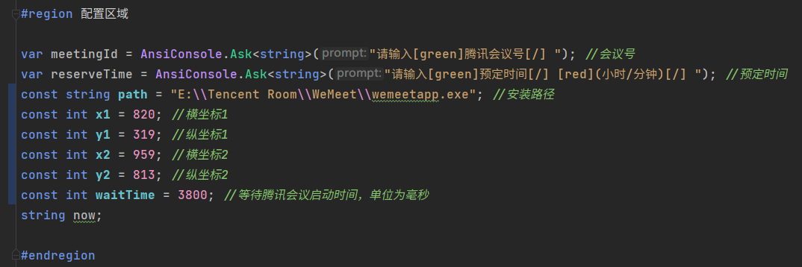

## 👁️ 来看看 [GUI 版](https://github.com/Yoroion/FuckMeetingPlus)

# 📡 FuckTencentMeeting

> 使用 C# 编写的自动进入会议程序 ~~便于摸鱼~~

## 环境要求

✅ 任意一个可以写 C# 的 IDE 或编辑器

✅ .NET SDK 6.0

✅ Windows 10 或更高

## 背景

疫情防控导致学校停课，老师使用腾讯会议上课，经常要求在奇怪的时间点进入会议...

所以写了这个程序，顺便练习 C# 语言

## 展示

> 旧版运行效果

> 新版运行效果 (Colorful!)

## 文件说明

| 文件名           | 描述        |
| -----------      |-----------|
| Program.cs       | 极简的主逻辑   |
| Win32Method.cs   | Win32 API 封装 |

## 使用教程
1. 在 `Program.cs` 中，修改配置区域

2. 使用 *Snipaste* 或其他软件，获取需要按点击的坐标
3. 执行 `dotnet publish` 命令，生成可执行文件
4. 注意输入预定时间需要符合格式，如 `08/59`

## 开源协议

FuckTencentMeeting 基于 WTFPL 协议开源
