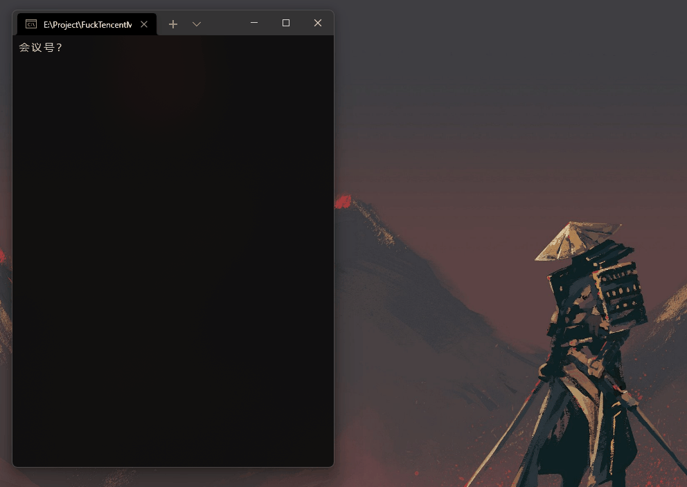

# 腾讯会议自动入会
使用 C#10 编写，自动进入会议，解放你的双手(

## 环境要求
- .NET 6.0+
- Windows 10+ 操作系统

## 背景

- 因为疫情，学校停课，老师要求使用腾讯会议，我受到启发，写了这个小程序，顺便练练 C# 语言
- 逻辑就是设置时间，获取按钮所在的坐标，模拟鼠标点击和键盘输入
- 注意本程序默认基于 1080P 分辨率，其它分辨率可是使用 `Snipaste` 软件获取坐标
- 由于使用了 .NET Framework 的 NuGet 库，不能跨平台...

## 引用

本项目使用了 `H.InputStimulator` 库 (Target 4.6.2)

## 演示

