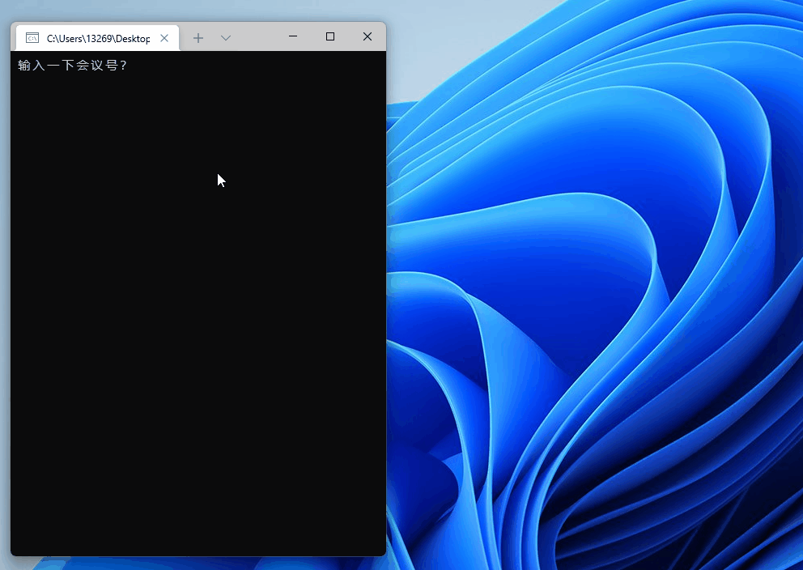
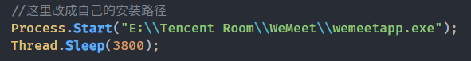

## 👁️ 关注最新 [重构升级版](https://github.com/Yoroion/FuckMeetingPlus)
# 📡 腾讯会议自动入会
> 使用 C# 编写的自动进入会议程序，~~便于摸鱼~~

## 演示

## 环境要求
- .NET 6.0+
- Windows 10+ 
- Visual Studio 2022 / VS Code + C# Extension

## 背景

- 疫情防控导致学校停课，老师上课使用腾讯会议，我受到启发，写了这个程序，顺便练练 C# 语言
- 逻辑就是设置时间，获取按钮所在的坐标，模拟鼠标点击和键盘输入
- 由于使用了 .NET Framework 的 NuGet 库和 Win32 API，肯定是不能跨平台的
- **注意**：本程序默认基于 1080P 分辨率，其它分辨率可以使用 `Snipaste` 软件获取坐标

## 文件说明
| 文件名           | 描述                |
| -----------      | -----------        |
| Program.cs       | 超级简单的主逻辑程序 |
| Win32Method.cs   | 封装了两个 Win32 API |

## 使用教程
1.  Clone 本项目
2.  在 `Program.cs` 中，修改腾讯会议的安装路径

3. 使用 `Snipaste` 或其他软件，获取需要按点击的坐标
4.  执行 `dotnet publish` 命令，生成 .exe 文件

## 开源协议
Do What The Fuck You Want To Public License
